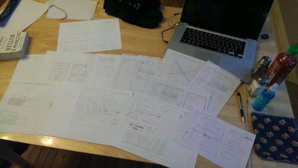
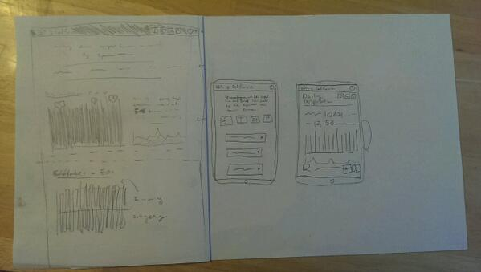
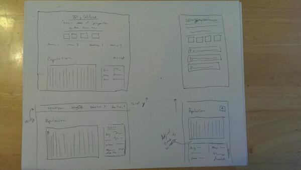
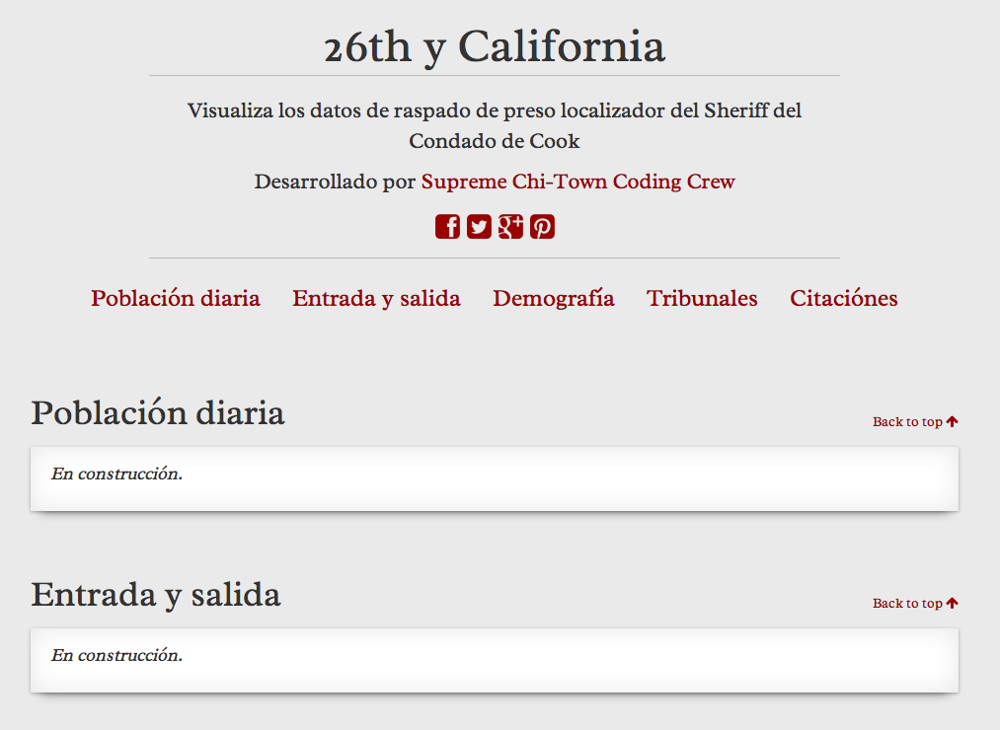
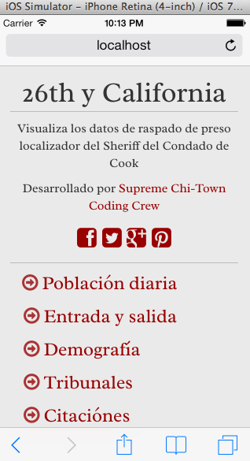
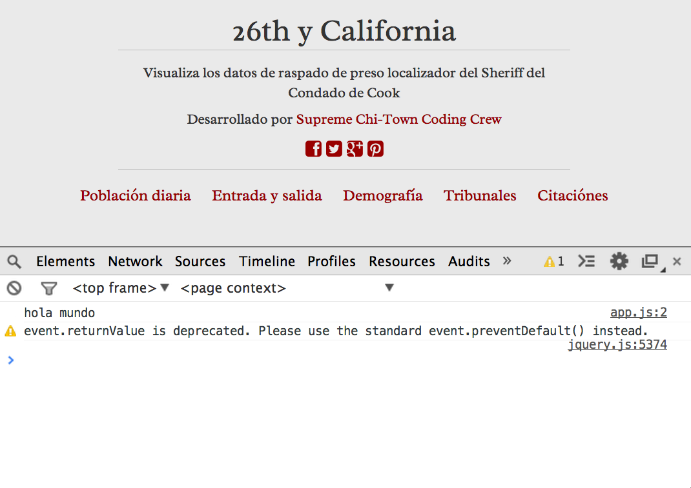
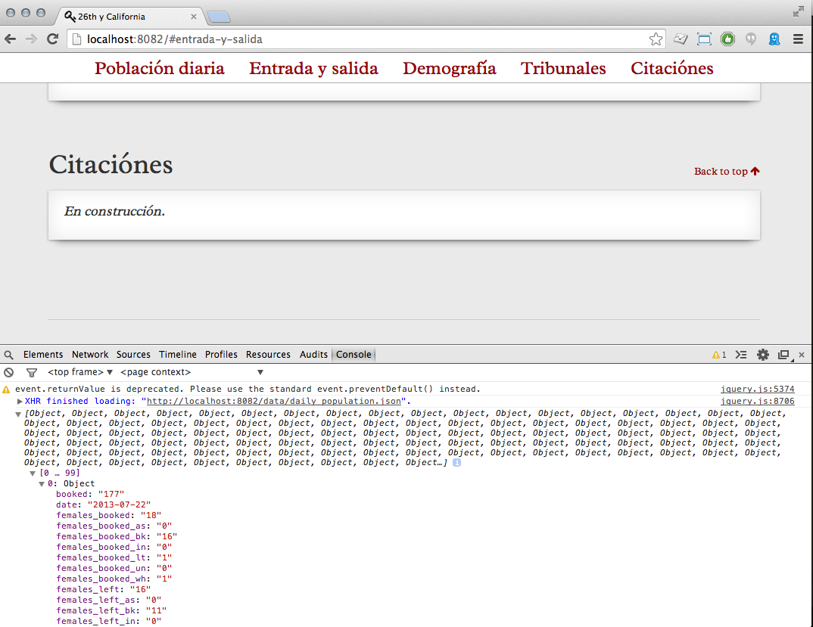
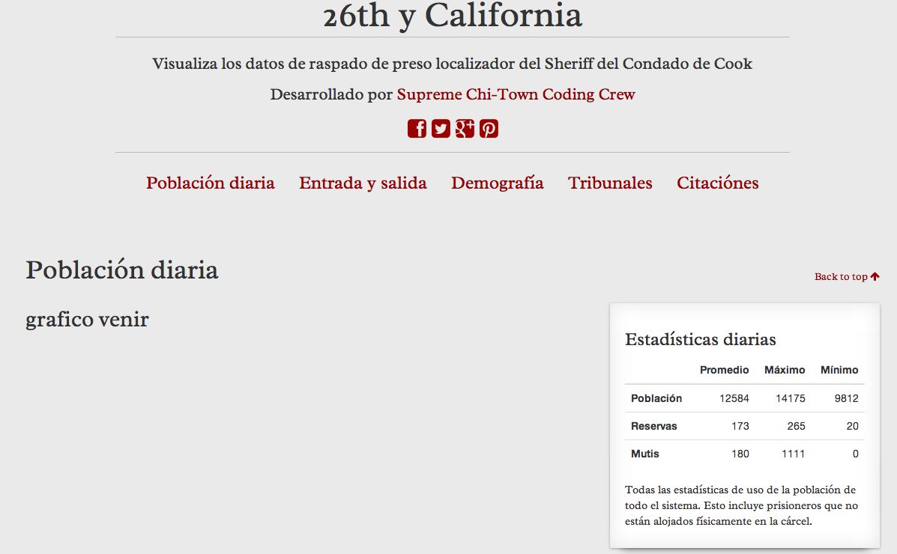
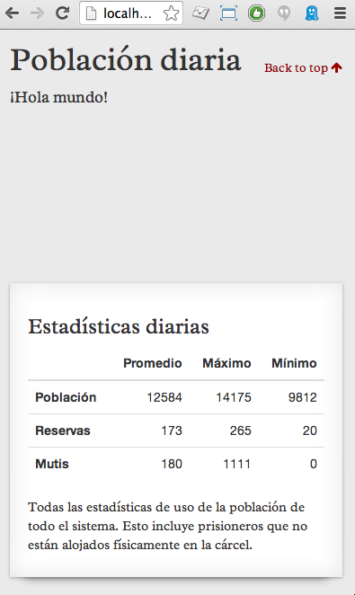

:tocdepth: 2

========================================
Migrahack: Responsive data visualization
========================================

This tutorial will walk you through the process of building a simple
news application and publishing it on the web. You will learn the basics
of responsive design and charting with D3 by visualizing data from the
`@chitowncoders <http://twitter.com/chitowncoders/>`_ `Cook
County Jail scraper <https://github.com/sc3/cookcountyjail/>`_.

You will get hands-on experience in every stage of the development process:
working with data, sketching mockups, writing HTML, CSS, and Javascript
and recording your work using Git's version control system. 

You will learn to use Backbone JS to structure your application, Underscore JS
to process data, Twitter Bootstrap to structure your markup, and D3 for 
data visualization. The techniques used here were first described in
`Responsive Charts with D3 and Backbone 
<http://blog.apps.chicagotribune.com/2014/03/07/responsive-charts-with-d3-and-backbone/>`_
by Ryan Nagle.

This guide was prepared for Migrahack Mexico City, April 3-6, 2014 and presented
by `David Eads <http://twitter.com/eads>`_.

* Code repository: `https://github.com/sc3/26thycalifornia <https://github.com/sc3/26thycalifornia>`_
* Demonstration: `http://26thycalifornia.recoveredfactory.net <http://26thycalifornia.recoveredfactory.net>`_
* Documentation: `http://migrahack.readthedocs.org/ <http://migrahack.readthedocs.org/>`_
* Issues: `https://github.com/sc3/26thycalifornia/issues <https://github.com/sc3/26thycalifornia/issues>`_

Prerequisites
=============

1. A fundamental understanding of HTML, CSS, and Javascript
1. A modern web browser (Chrome or Chromium)
2. A `text editor <https://en.wikipedia.org/wiki/Text_editor>`_ to work with plain text files
3. A `command-line interface <https://en.wikipedia.org/wiki/Command-line_interface>`_ to interact with your computer
4. `Git <http://git-scm.com/>`_ version control software
5. (Optional) An account at `GitHub.com <http://www.github.com>`_

Web browser
-----------

Firefox or Chrome. 

Text editor
---------------------

You'll be editing simple `"plain text" files <https://en.wikipedia.org/wiki/Text_file>`_.

Just like you need a word processor for writing human language, you need a text editor
for working with plain text such as HTML markup, CSS, and Javascript.

`Sublime Text <http://www.sublimetext.com/3>`_ is highly recommended. It's fast,
simple, and runs on all major platforms.

Command-line interface
----------------------

Every computer should be a way to open a window that lets you type in commands. Different operating
systems give this tool slightly different names, but they all have some form of it, and there are
alternative programs you can install as well. 

On Windows you can find the command-line interface by opening the "command prompt." Here are instructions for 
`Windows 8 <http://windows.microsoft.com/en-us/windows/command-prompt-faq#1TC=windows-8>`_ 
and `earlier versions <http://windows.microsoft.com/en-us/windows-vista/open-a-command-prompt-window>`_.

On Apple computers, you open the `"Terminal" application 
<http://blog.teamtreehouse.com/introduction-to-the-mac-os-x-command-line>`_. 

Ubuntu Linux comes with a program of the `same name 
<http://askubuntu.com/questions/38162/what-is-a-terminal-and-how-do-i-open-and-use-it>`_.

Git and GitHub
--------------

`Git <http://git-scm.com/>`_ is a version control program for saving the changes 
you make to files over time. This is useful when you're working on your own, 
but quickly becomes essential with large software projects, especially if you work with other developers. 

`GitHub <https://github.com/>`_ is a website that hosts git code repositories, both public and private. It comes
with many helpful tools for reviewing code and managing projects. It also has some 
`extra tricks <http://pages.github.com/>`_ that make it easy to publish web pages, which we will use later. 

GitHub offers helpful guides for installing Git in 
`Windows <https://help.github.com/articles/set-up-git#platform-windows>`_,
`Macs <https://help.github.com/articles/set-up-git#platform-mac>`_ and
`Linux <https://help.github.com/articles/set-up-git#platform-linux>`_. You can verify
it's installed from your command line like so:

.. code-block:: bash

    git --version

Once that's done, you should create an account at GitHub, if you don't already have one.
It shouldn't cost you anything. `The free plan <https://github.com/pricing>`_ 
is all that's required to complete this lesson.

Planning: Know your data
========================

Principles
----------

- Acquire meaningful data (the data for this tutorial comes from a 
  `scraper <https://github.com/sc3/cookcountyjail>`_).
- Question the data:
  - Does the data need cleaning or scrubbing?
  - What comparisons can be made?
  - How can the data be bucketed or categorized?
  - How can the data be normalized and averaged?
- Process data: "Boil down" into useful summary data structures.
  - Time series
  - Ratios
  - Distributions 
- Publish raw and summarized data with a web API

`Time summaries of crime incident data <https://www.dropbox.com/s/m3jlrrld5rnmnpw/time%20summaries%20of%20crime%20incident%20data%20-%20data%20made%20simple%20hackathon%202014.pdf>`_ by David Eads describes how the the Chicago Tribune applies these techniques to crime data.

Our data
--------

Our data comes from `http://cookcountyjail.recoveredfactory.net/api/2.0/daily_population <http://cookcountyjail.recoveredfactory.net/api/2.0/daily_population>`_. This API endpoint provides data in the `JSON <http://en.wikipedia.org/wiki/JSON>`_ format that looks like:

.. code-block:: json

    [
        {
            date: "2013-07-22",
            booked: "177",
            females_booked: "18",
            females_booked_as: "0",
            females_booked_bk: "16",
            females_booked_in: "0",
            females_booked_lt: "1",
            females_booked_un: "0",
            females_booked_wh: "1",
            females_left: "16",
            females_left_as: "0",
            females_left_bk: "11",
            females_left_in: "0",
            females_left_lt: "2",
            females_left_un: "0",
            females_left_wh: "3",
            females_population: "1092",
            females_population_as: "5",
            females_population_bk: "775",
            females_population_in: "3",
            females_population_lt: "107",
            females_population_un: "0",
            females_population_wh: "202",
            left: "187"
            males_booked: "159",
            males_booked_as: "1",
            males_booked_bk: "98",
            males_booked_in: "0",
            males_booked_lt: "30",
            males_booked_un: "0",
            males_booked_wh: "30",
            males_left: "171",
            males_left_as: "4",
            males_left_bk: "119",
            males_left_in: "0",
            males_left_lt: "34",
            males_left_un: "0",
            males_left_wh: "14",
            males_population: "12012",
            males_population_as: "73",
            males_population_bk: "8912",
            males_population_in: "7",
            males_population_lt: "1951",
            males_population_un: "0",
            males_population_wh: "1069",
            population: "13104",
        },
        // ...
    ]

As you can see, this date provides daily population and booking / exit counts for each day the
scraper ran. Such data can be used to generate simple but useful statistics like average/min/max
and to plot time series.

Planning: Sketch your interface
===============================

Step 1: Sketch a lot
--------------------

Step 2: Winnow it down
----------------------

Step 3: Sketch again
--------------------

Final concept
-------------

Using just HTML, I banged together a concept for the site. Once you're done with the set up chapters,
you will have a site that looks like this on a desktop:

And looks like this on an iPhone:

Set up: Bootstrap your project
==============================

.. note::

    Don't care about the nitty gritty details of setting up your project?
    Not running OS X or Linux? Just skip ahead to the *Build* chapters. 

Let's go through the gory process of setting up a basic static site. Shameless plug: Tools like
`Tarbell <http://tarbell.tribapps.com>`_ automate this process.

Create files and directories
----------------------------

Start by creating a directory for your project.

.. code-block:: bash

    mkdir 26thycalifornia
    cd 26thycalifornia

``mkdir`` creates a directory. ``cd`` changes the current working directory.

Now create a bunch of empty files and directories.

.. code-block:: bash

    mkdir css
    mkdir data
    mkdir js
    touch index.html
    touch README.md
    touch css/style.css
    touch js/Data.js
    touch js/Charts.js
    touch js/app.js

``touch`` creates an empty file if none exists.

.. note::
    So how do you know what to create to start off with? Practice! Your sketches and experience will
    be your guide.

Hello Git 
---------

You've gone from an empty directory to a structure to start working with. This would be a good time
to make a note of the work you've done so far. Say hello to the Git version control system:

.. code-block:: bash

    git init

The ``git`` command is always followed by a *subcommand*, like `init`, which tells git what to do.
The ``init`` subcommand creates a new repository in the current directory.

Find out the state of your repository.

.. code-block:: bash

    git status
    # On branch master
    #
    # Initial commit
    #
    # Untracked files:
    #   (use "git add <file>..." to include in what will be committed)
    #
    #       README.md
    #       css/
    #       index.html
    #       js/

Tell git about all the new files you've created:

.. code-block:: bash
    
    git add .

The ``add`` subcommand adds files to be committed.
The dot ``.`` signifies all new files. You can read ``git add .``
as "add all new and changed files to the next batch of changes to be logged."

Check the status of your repository again.

.. code-block:: bash

    git status
    # On branch master
    #
    # Initial commit
    #
    # Changes to be committed:
    #   (use "git rm --cached <file>..." to unstage)
    #
    #       new file:   README.md
    #       new file:   css/style.css
    #       new file:   index.html
    #       new file:   js/Data.js
    #       new file:   js/Charts.js
    #       new file:   js/app.js

Log your changes (in this case, adding all those empty files).  The ``commit`` subcommand 
creates a new entry in the history with a message attached to it. 

.. code-block:: bash

    git commit -m "creado 26th y california"

The ``-m "Some message"`` flag specifies a message to associate with this set of changes.

Did it work? The ``log`` subcommand provides the history of the current repository:

.. code-block:: bash

    git log
    # commit 8b8b97d3a95db02bc47a544bf0d6a1def11e5bbe
    # Author: David Eads <davideads@gmail.com>
    # Date:   Tue Apr 1 23:35:16 2014 -0500
    #
    #   creado 26th y california 

.. note::

    When you have more entries in your history log than can fit on the screen, git will open a
    'pager' that allows you to use the arrow keys to navigate the log. To quit, press ``q``.

Download some data
------------------

You created a ``data`` directory but didn't ``touch`` any files inside it. Now you need to
get a snapshot of the data from our API.

The `curl` command can download files from the web. In this case we're sending the response to a 
file called ``data/daily_population.json``.

.. code-block:: bash

    curl http://cookcountyjail.recoveredfactory.net/api/2.0/daily_population > data/daily_population.json
    #  % Total    % Received % Xferd  Average Speed   Time    Time     Time  Current
    #                                 Dload  Upload   Total   Spent    Left  Speed
    #100  289k  100  289k    0     0   769k      0 --:--:-- --:--:-- --:--:--  769k
    

You can specify individual files using the `git add` command. You'll use that to add just the file
you downloaded.

.. code-block:: bash

    git add data/daily_population.json 

Now check the status.

.. code-block:: bash

    git status
    # On branch master
    # Changes to be committed:
    #   (use "git reset HEAD <file>..." to unstage)
    #
    #       new file:   data/daily_population.json

And commit.

.. code-block:: bash

    git commit -m "descargar los datos de población diaria"
    # [master 3b36517] descargar los datos de población diaria
    #  1 file changed, 1 insertion(+)
    #  create mode 100644 data/daily_population.json

.. note::

    You may have detected a pattern. You'll want to use ``git add <filename>`` to "stage" your changes,
    ``git status`` to see what you're about commit, and ``git commit -m "your message"`` to log your
    changes.

    That's all the git this tutorial will cover, but you'll use it religiously. You'll skip the ``git status``
    step in subsequent examples. If you ever want to see what you've been up to, just run ``git log``.

index.html: page skeleton
-------------------------

Open ``index.html`` in your text editor and start typing:

.. code-block:: html
    
    <!doctype html>
    <html>

    <head>
      <!-- Título -->
      <!-- Meta -->
      <!-- CSS -->
    </head>

    <body>
      <!-- Introducción -->
      <!-- Navegación -->
      <!-- Contenido -->
      <!-- Bibliotecas de código -->
      <!-- Aplicación -->
    </body>
    </html>

Now commit your changes:

.. code-block:: bash

    git add index.html
    git commit -m "crear la estructura de index.html"

.. note:: 

    You may need to add or change sections of the file later. Your starting point will never be
    perfect, so don't worry about making it perfect. Just be clean and consistent.
    
Each of the commented sections will need content based on our sketches. Let's do this! You'll work top
to bottom, showing only the section of the file you're working on.

.. note::

    You'll notice we're going all out and adding basic social media sharing tags and analytics.

index.html: Title
-----------------

.. code-block:: html
    
      <!-- Título -->
      <title>26th y California</title>
    
.. code-block:: bash

    git add index.html
    git commit -m "incorporar titulo de proyecto"

index.html: Meta
----------------

The meta section includes the favicon link and all ``<meta>`` tags to provide browser and social media directives.

You'll need an image for social media. Happily, `this photo by Eric Allix Rogers <https://www.flickr.com/photos/reallyboring/2855217420/in/photolist-5miJEy-5VukUC-5Zy7ae-6oRFwf-6oRFP5-6uSQYK-6BWtLb-6Ct6as-6GL6MD-6L4B9P-6L8JKu-6MD3Kj-6MD4dy-6T2LBE-79MRog-bvQXLT-af8LuU-eibpcd-bW1JVN-dGxRau-dGxPgd-dGso42-dGxQV7-dGsqdr-dGsmaX-eibp5m-8LvsAS-8AfhiJ-aBnU3R-i8Jizv-ftd9j6-ftsunJ-ftsv8w-ftdaq8-ftda8n-ftswgY-cfwpVo-8mMXLL-dGshR4-dGxKv3-dGskQF-bnNVDk-aeJ1ku-bnNWLZ-8d7z1B-a62iNc-dCwbJu-cgoWvQ-ma895V-a7Z57T-8ebeAH/>`_ is released under a Creative Commons license.

You'll also need a favicon. I made one and posted it online for you to use.

Make the directory and download the files.

.. code-block:: bash

    mkdir img
    curl http://26thycalifornia.recoveredfactory.net/img/favicon.ico >> img/favicon.ico
    curl https://farm4.staticflickr.com/3143/2855217420_643b6f195e_m_d.jpg >> img/guard-tower-small.jpg
    curl https://farm4.staticflickr.com/3143/2855217420_9ac4d87192_o_d.jpg >> img/guard-tower-large.jpg

This time when you use git add, you can specify the whole ``img`` directory:

.. code-block:: bash

    git add img
    git commit -m "incorporar favicon y fotos para facebook"

Add the meta section to your index.html:

.. code-block:: html

      <!-- Meta -->
      <link rel="shortcut icon" href="img/favicon.ico" />
      <meta http-equiv="X-UA-Compatible" content="IE=edge,chrome=1">
      <meta name="viewport" content="width=device-width, initial-scale=1.0, user-scalable=no">
      <meta property="og:url" content="http://26thycalifornia.recoveredfactory.net" />
      <meta property="og:title" content="26th y California" />
      <meta property="og:type" content="website" />
      <meta property="og:image" content="img/guard-tower-small.jpg" />
      <meta property="og:description" content="Investigando datos raspan del Sheriff del Condado de Cook Inmate Locator." />

.. code-block:: bash

    git add index.html
    git commit -m "incorporar metadatos y icono"

index.html: CSS
---------------

Add stylesheet links. Here you load Bootstrap, Font Awesome, the Radley webfont, and our custom stylesheet.
You will also add "shims" in this section, which will make your site work better with older browsers.

.. code-block:: html

      <!-- CSS -->
      <link rel="stylesheet" type="text/css" href="//cdnjs.cloudflare.com/ajax/libs/twitter-bootstrap/3.1.1/css/bootstrap.min.css" />
      <link rel="stylesheet" type="text/css" href="//cdnjs.cloudflare.com/ajax/libs/font-awesome/4.0.3/css/font-awesome.min.css" />
      <link href='http://fonts.googleapis.com/css?family=Radley:400' rel='stylesheet' type='text/css'>
      <link rel="stylesheet" type="text/css" href="css/style.css" />

      <!--[if lt IE 9]>
        
        
      <![endif]-->

.. code-block:: bash

    git add index.html
    git commit -m "incorporar hojas de estilo"

.. note:: 

    This project relies heavily on content delivery network (CDN) versions of popular libraries and
    fonts. If your Internet access is spotty, you'll want to download these files to your computer
    and check them into your repository. `bower <http://bower.io/>`_ is highly recommended for 
    easy installation of popular Javascript libraries.

index.html: Analytics
---------------------

When you set up the skeleton, we made a terrible omission. Most real world pages should have some form
of analytics. That's easy enough to fix. Let's add Google analytics to the ``<head> ... </head>``. 

.. code-block:: html

      <!-- Analíticas -->
      

.. code-block:: bash

    git add index.html
    git commit -m "incorporar analíticas"

Interlude: Adding css/style.css
-------------------------------

You've finally made it to the ``<body>``. Before you go much further, dump our handy dandy starter
CSS template into the ``css/style.css`` file. Like the basic HTML page, this is a basic framework
to start working from.

.. code-block:: css

    /* 26th y california css */
    body {
      font-family: "Radley", Georgia, serif;
      font-size: 18px;
      background-color: #eaeaea;
    }

    a { color: #900; }
    a:hover { color: #c00; }

    .pagenav {
      padding: 4px 0;
      margin-bottom: 50px;
    }
    .pagenav.affix {
      width: 100%;
      z-index: 100;
      background-color: #fff;
      border-bottom: 1px solid #aaa;
      height: 40px;
      top: 0;
      left: 0;
    }

    .pagenav .nav { 
      float: none;
      display: inline-block;
      font-size: 24px;
      line-height: 28px;
    }
    .pagenav .nav>li>a {
      padding: 2px 15px;
    }
    .pagenav .nav>li>a:hover, .pagenav .nav>li>a:focus {
      background-color: #fff;
    }

    .box {
        position: relative;
        margin: 15px 0;
        padding: 15px 20px;
        background:#fff;
        -webkit-box-shadow:0 1px 4px rgba(0, 0, 0, 0.3), 0 0 40px rgba(0, 0, 0, 0.1) inset;
           -moz-box-shadow:0 1px 4px rgba(0, 0, 0, 0.3), 0 0 40px rgba(0, 0, 0, 0.1) inset;
                box-shadow:0 1px 4px rgba(0, 0, 0, 0.3), 0 0 40px rgba(0, 0, 0, 0.1) inset;
    }
     
    .box:before {
      content:"";
      position:absolute; 
      z-index:-2;
      top:50%;
      bottom:0;
      left:10px;
      right:10px;
      -webkit-box-shadow:0 0 15px rgba(0,0,0,0.6);
      -moz-box-shadow:0 0 15px rgba(0,0,0,0.6);
      box-shadow:0 0 15px rgba(0,0,0,0.6);
      -moz-border-radius:10px / 100px;
      border-radius:10px / 100px;
    }

    .intro {
      text-align: center;
      border-bottom: 1px solid #bbb;
      padding-bottom: 10px;
      margin: 0 120px 20px 120px;
      font-size: 22px;
    }
    .intro .social-links {
      margin-top: 10px;
      font-size: 29px;
    }
    .intro .social-links a {
      display: inline-block;
    }

    h1.headline { 
      text-align: center;
      margin-top: 20px;
      margin-bottom: 20px;
      font-size: 48px;
      line-height: 60px;
      border-bottom: 1px solid #bbb;
    }

    hr {
      background-color: #ccc;
      border: none;
      height: 1px;
      margin: 40px 0;
    }

    section {
      margin-bottom: 65px;
    }

    .back {
      float: right;
      margin-top: -30px;
      font-size: 14px;
    }

    /* -- Su estilos -- */

    @media (max-width: 768px) {
      h1.headline { 
        text-align: center;
        margin-top: 10px;
        margin-bottom: 10px;
        font-size: 36px;
        line-height: 48px;
      }

      .intro {
        margin: 0;
        font-size: 16px;
      }

      .pagenav {
        margin-bottom: 10px;
      }

      .pagenav .nav { 
        display: block;
        font-size: 24px;
        line-height: 38px;
        text-align: left;
      }

      .pagenav li {
        float: none;
      }

      .pagenav li a:before {
        font-family: FontAwesome;
        margin-right: 5px;
        color: #a33;
        content: "\f18e";
      }

      .pagenav.affix {
        position: static;
        height: auto;
        border: none;
        background-color: transparent;
      }
    }

.. code-block:: bash

    git add css/style.css 
    git commit -m "incorporar estilos"

index.html: Add introduction
----------------------------

Add an introduction with social media links and a short credit.

.. code-block:: html

      <!-- Introducción -->
      

      

        

          <h1 class="headline">26th y California</h1>
          
Visualiza los datos de raspado de preso localizador del Sheriff del Condado de Cook

          
Desarrollado por <a href="https://github.com/sc3/sc3">Supreme Chi-Town Coding Crew</a>

          

            <a target="_blank" href="https://www.facebook.com/sharer.php?u=http%3A%2F%2F26thycalifornia.recoveredfactory.net&t=26th+y+California">
              <i class="fa fa-facebook-square"></i>
            </a>
            <a target="_blank" href="https://twitter.com/share?url=http%3A%2F%2F26thycalifornia.recoveredfactory.net&text=26th+y+California">
              <i class="fa fa-twitter-square"></i>
            </a>
            <a target="_blank" href="https://plus.google.com/share?url=http%3A%2F%2F26thycalifornia.recoveredfactory.net">
              <i class="fa fa-google-plus-square"></i>
            </a>
            <a target="_blank" href="http://pinterest.com/pin/create/button/?url=http%3A%2F%2F26thycalifornia.recoveredfactory.net&media=http%3A%2F%2F26thycalifornia.recoveredfactory.net%2Fimg%2Fguard-tower-large.jpg&description=26th+y+California">
              <i class="fa fa-pinterest-square"></i>
            </a>
          

        

      

.. code-block:: bash

    git add index.html
    git commit -m "incorporar introducción"

index.html: Add content placeholders
------------------------------------

You're ready to start adding big sections and seeing things come together. Add some "En construcción"
boxes to the content section.

.. code-block:: html
      
      <!-- Contenido -->
      

        <section id="poblacion-diaria">
          <h1>Población diaria</h1>
          <a href="#top" class="back">Back to top <i class="fa fa-arrow-up"></i></a>
          

            
<em>En construcción.</em>

          

        </section>
        <section id="entrada-y-salida">
          <h1>Entrada y salida</h1>
          <a href="#top" class="back">Back to top <i class="fa fa-arrow-up"></i></a>
          

            
<em>En construcción.</em>

          

        </section>
        <section id="demografia">
          <h1>Demografía</h1>
          <a href="#top" class="back">Back to top <i class="fa fa-arrow-up"></i></a>
          

            
<em>En construcción.</em>

          

        </section>
        <section id="tribuneales">
          <h1>Tribuneales</h1>
          <a href="#top" class="back">Back to top <i class="fa fa-arrow-up"></i></a>
          

            
<em>En construcción.</em>

          

        </section>
        <section id="citacion">
          <h1>Citaciónes</h1>
          <a href="#top" class="back">Back to top <i class="fa fa-arrow-up"></i></a>
          

            
<em>En construcción.</em>

          

        </section>
      

.. code-block:: bash

    git add index.html
    git commit -m "incorporar contenido de la muestra"

index.html: Add footer
----------------------

We almost forgot that we need to attribute the poor photographer who took the guard tower shot. Add
a footer with an attribution link.

.. code-block:: html

  <!-- Pie de pagina -->
  

    

    
<small>"Guard Tower" fotografia del autor Eric Allix Rogers con Creative Commons <a href="https://creativecommons.org/licenses/by-nc-sa/2.0/">Attribution-NonCommercial-ShareAlike 2.0</a></small>

  

.. code-block:: bash

    git add index.html
    git commit -m "incorporar pie de pagina"

index.html: Scripts
-------------------

Add libraries and application code in a single commit.

.. code-block:: html

      <!-- Bibliotecas de código -->
      
      
      
      
      
      

      <!-- Aplicación -->
      
      
      

.. code-block:: bash

    git add index.html
    git commit -m "incorporar bibliotecas de código y aplicacion"

js/app.js: Hello world
----------------------

And last but not least, get the Javascript add running by editing ``js/app.js``:

.. code-block:: javascript

    $(document).ready(function() {
      console.log("hola mundo");
    });

.. code-block:: bash

    git add js/app.js
    git commit -m "hola mundo"

Did it work?
------------

If you haven't been checking in your browser, now is the time. Open index.html in your browser and
open your console. ¡Hola mundo!

Build: Getting set up
=====================

You will now build some Javascript tools to process and analyze the daily population data from
the jail. 

Download
--------

@TODO Download from tagged build of demo repo

Create placeholders
-------------------

Open ``index.html`` in your editor. Find the section associated with the jail population:

.. code-block:: html

    <section id="poblacion-diaria">
      <h1>Población diaria</h1>
      <a href="#top" class="back">Back to top <i class="fa fa-arrow-up"></i></a>
      

        
<em>En construcción.</em>

      

    </section>

There it is! And construcción is now happening. You should stub out the basic architecture. In this
case it will be a wide column for a chart and a narrow column for some statistics.

.. code-block:: html

    <section id="poblacion-diaria">
      <h1>Población diaria</h1>
      <a href="#top" class="back">Back to top <i class="fa fa-arrow-up"></i></a>
      

        

          <h2>grafico venir</h2>
        

        

          

            <h2>tabla venir</h2>
          

        

      

    </section>

Now commit your changes!

.. code-block:: bash

    git commit -am "incorporar avisos a 'venir' a seccion poblacion"

.. note::

    Did you notice how we used the ``-a`` flag in ``git commit -am <message>``? This commits all 
    modified files in your repository, sight unseen. It's effiecient, but should be used with care.
    For the rest of the tutorial we'll use it exclusively except when adding new files. Commit
    messages will no longer come with any description but simply follow every code block. 

Build: Set up Backbone collection
---------------------------------

You will first need a way of accessing and processing your data.

Open ``js/Data.js`` to create a Backbone *collection* to keep track of the data.

.. code-block:: javascript

    var DailyPopulationCollection = Backbone.Collection.extend({
      url: 'data/daily_population.json'
    });

Hmmm, that didn't seem very hard. What will this do for you?

Replace ``js/app.js`` with some debugging code to see what's going on:

.. code-block:: javascript

    $(document).ready(function() {
      var population = new DailyPopulationCollection();
      population.on("sync", function() { console.log(this.toJSON()); });
      population.fetch();
    });

You did three things on those three lines: First, you created a new instance of the daily population
collection. Then you bound a function that listens for changes to the population collection and logs
the contents of the collection to your console. Finally, you fetched the population data. You should
see something like this in your browser:

.. code-block:: bash

    git commit -am "incorporar collecion y depuracion de collecion" 

.. note::

    Your editor probably now have several tabs open: index.html, js/Data.js, js/Charts.js,
    js/app.js, and css/style.css. This is as it should be. Many common web development tasks involve
    changing several files in tandem. 

Build: Process data with collection methods
-------------------------------------------

Switch back to ``js/Data.js``. No data in perfect. In this case, our data represents numbers as
strings. Add your first collection method -- the special ``parse`` method -- to process your data.

.. code-block:: javascript

    var DailyPopulationCollection = Backbone.Collection.extend({
      url: 'data/daily_population.json',
      parse: function(data) {
        // Cast all keys to numbers
        return _.map(data, function(day) {
          for (key in day)
              day[key] = Number(day[key]);
          return day;
        });
      }
    });

.. code-block:: bash

    git commit -am "incorporar parse funcion"

Add a custom method called ``average`` to calculate the average value for a daily field: 

.. code-block:: javascript

    var DailyPopulationCollection = Backbone.Collection.extend({
      url: 'data/daily_population.json',

      parse: function(data) {
        // Cast all strings to numbers
        return _.map(data, function(day) {
          for (key in day)
              day[key] = Number(day[key]);
          return day;
        });
      },

      average: function(field) {
        // Calculate average for 'field`
        var values = this.pluck(field)
        var sum = _.reduce(values, function(memo, num) { return memo + num; }, 0);
        return Math.round(sum / values.length);
      }
    });

Update ``js/app.js`` to see if it worked.

.. code-block:: javascript

    $(document).ready(function() {
      var population = new DailyPopulationCollection();
      population.on("sync", function() { console.log("Average:", this.average('population')); });
      population.fetch();
    });

If you reload your browser, your console should report something like "Average: 12584.20158102766".

.. code-block:: bash

    git commit -am "incorporar la funcion de media" 

Now add ``max`` and ``min`` methods in ``js/Data.js``:

.. code-block:: javascript

    var DailyPopulationCollection = Backbone.Collection.extend({
      url: 'data/daily_population.json',

      parse: function(data) {
        // Cast all strings to numbers
        return _.map(data, function(day) {
          for (key in day)
              day[key] = Number(day[key]);
          return day;
        });
      },

      average: function(field) {
        // Calculate average for 'field`
        var values = this.pluck(field)
        var sum = _.reduce(values, function(memo, num) { return memo + num; }, 0);
        return Math.round(sum / values.length);
      },

      get_max: function(field) {
        // Calculate max for 'field'
        return this.max(function(day) {
          return day.get(field);
        });
      },

      get_min: function(field) {
        // Calculate min for 'field'
        return this.min(function(day) {
          return day.get(field);
        });
      }
    });

... and see if it worked by adding more debugging lines to ``js/app.js``:

Update ``js/app.js`` to see if it worked.

.. code-block:: javascript

    $(document).ready(function() {
      var population = new DailyPopulationCollection();
      population.on("sync", function() {
        console.log("Average:", this.average('population')); 
        console.log("Min:", this.get_min('population')); 
        console.log("Max:", this.get_max('population')); 
      });
      population.fetch();
    });

.. code-block:: bash

    git commit -am "incorporar funciones de max y min" 

.. note::

    First you created the bare bones of a collection. Now you're adding some methods. This simple 
    pattern -- make some changes, make sure they work, commit, and keep going -- is the fundamental 
    rhythm of software development.

Build: Make a table
===================

Open up ``js/Charts.js`` to add a Backbone view that will render a table of data:

.. code-block:: javascript

    var StatsTableView = Backbone.View.extend({
      initialize: function(options) {
        this.template = _.template(options.template);
        this.collection.on('sync', this.render, this);
      },
      render: function() {
        this.$el.html(this.template({
          collection: this.collection
        }));
        return this;
      },
    });

    
.. code-block:: bash

    git commit -am "incorporar StatsTableView en Charts.js" 

This simple Backbone view puts most of the work onto the template. The ``intialize`` method says to use the template passed in via the options and to 
listen for data changes to render.

Now you must create the template and a new instance of ``StatsTableView``. Start by adding the template to ``index.html`` in 
the aplicación section:

.. code-block:: html

  <!-- Aplicación -->
  
  
  
  

.. code-block:: bash

    git commit -am "incorporar plantilla por estadisticas de poblacion" 

Add a place in ``index.html``'s population section for your handiwork along with a bit of
copy explaining these numbers are based on system-wide population counts, which include people who
are not physically located at the jail:

.. code-block:: html

    <section id="poblacion-diaria">
      <h1>Población diaria</h1>
      <a href="#top" class="back">Back to top <i class="fa fa-arrow-up"></i></a>
      

        

          <h2>grafico venir</h2>
        

        

          

            <h3>Estadísticas diarias</h3>
            

            
Todas las estadísticas de uso de la población de todo el sistema. Esto incluye prisioneros que no están alojados físicamente en la cárcel.

          

        

      

    </section>

.. code-block:: bash

    git commit -am "incorporar elementos para StatsTableView" 

You need to execute your all this code you've written to see anything happen. 
Do that by updating ``js/app.js``:

.. code-block:: javascript

    $(document).ready(function() {
      var population = new DailyPopulationCollection();
      var population_table = new StatsTableView({
        el: $("#poblacion-diaria .stats"),
        collection: population,
        template: $('#population-table-template').html(),
      }); 
      population.fetch();
    });

.. code-block:: bash

    git commit -am "incorporar una nueva StatsTableView en app.js"

I happen to know our tables look kind of bad. The final step is to add some CSS to 
``css/style.css`` to spruce up our tables:

.. code-block:: css

    /* -- Su estilos -- */

    .table {
      font-family: "Helvetica Neue", Helvetica, Arial, sans-serif;
      font-size: 14px;
    }
    .table thead th,
    .table tbody td {
      text-align: right;
    }

.. code-block:: bash

    git commit -am "mejorar el estilo tabla"

When you're done, your final reload should look like this:

Break: Taking stock
=====================

You've now set up a project. You've created a Backbone collection to manage some data. You've
added methods to the collection to calculate summary values. You've created a Backbone view that
listens for the collection to change and renders a table of summary values.

    
Build: Make a time-series bar chart 
===================================

Buckle your seatbelt, it's finally time to make a chart with D3. You will be assisted in your 
efforts by the Chicago Tribune's lightweight `ChartView library 
<http://blog.apps.chicagotribune.com/2014/03/07/responsive-charts-with-d3-and-backbone/>`_.

A basic chart view
------------------

``ChartView`` is intended to be extended, just like a regular Backbone View. Open up ``js/Charts.js``
and add a simple chart view:

.. code-block:: javascript

    var DailyPopulationChartView = ChartView.extend({
      draw: function() {
        this.$el.html('¡Hola mundo!');
        return this;
      },
    });

.. code-block:: bash
    
    git commit -am "incorporar DailyPopulationChartView"

When creating a ChartView, you must supply a collection. The ChartView automatically listens for
changes to the collection and re-renders when they occur. 

All you need to do to make a ChartView work is to extend ChartView with your own chart class 
and specify a `draw` method. Then create a new instance with something like
``new MyChartView({el: $("#myel"), collection: mycollection})``.

To make it work here, first add an empty ``
`` to the ``poblacion-diaria`` section
of ``index.html``. This element will be your chart's container.

.. code-block:: html

    <section id="poblacion-diaria">
      <h1>Población diaria</h1>
      <a href="#top" class="back">Back to top <i class="fa fa-arrow-up"></i></a>
      

        

          

        

        

          

            <h3>Estadísticas diarias</h3>
            

            
Todas las estadísticas de uso de la población de todo el sistema. Esto incluye prisioneros que no están alojados físicamente en la cárcel.

          

        

      

    </section>

.. code-block:: bash
    
    git commit -am "incorporar elemento para DailyPopulationChartView"

Finally, create a new instance of ``DailyPopulationChartView`` in ``js/app.js``:

.. code-block:: javascript

    $(document).ready(function() {
      var population = new DailyPopulationCollection();

      var population_table = new StatsTableView({
        el: $("#poblacion-diaria .stats"),
        collection: population,
        template: $('#population-table-template').html(),
      });

      var population_chart = new DailyPopulationChartView({
        el: $("#poblacion-diaria .chart"),
        collection: population
      });

      population.fetch();
    });

.. code-block:: bash
    
    git commit -am "incorporar un instancia de DailyPopulationChartView a aplicacion"

When ``population.fetch()`` is called, the daily population chart will render. We should expect
to see "hola mundo" replace "grafico venir" in the left column. Reload! You should see something 
like this:

Add the d3 code
---------------

We use the ChartView's ``draw`` method to draw the chart. There are many fancy and interesting ways
to factor this code. To keep our code examples as similar as possible to D3's code examples, we'll
skip these fancy tricks.

Add more to ``js/Charts.js``:

.. code-block:: javascript

    var DailyPopulationChartView = ChartView.extend({
      draw: function() {
        var view = this;

        // Get data
        var maxDay = this.collection.get_max("population");
        var data = this.collection.toJSON();

        // A function to set y values for bars
        var yScale = d3.scale.linear()
          .range([this.dimensions.height, 0])
          .domain([0, maxDay.get("population")])
          ;

        // A function to set x positions for bars
        var startDate = new Date(data[0].date);
        var endDate = new Date(data[this.data.length - 1].date);
        var xScale = d3.time.scale()
          .range([0, this.dimensions.width])
          .domain([startDate, endDate])
          ;

        // Create canvas
        var svg = d3.select(this.el).append("svg")
            .attr("width", this.dimensions.wrapperWidth)
            .attr("height", this.dimensions.wrapperHeight)
          .append("g")
            .attr("transform", "translate(" + this.options.margin.left + "," + this.options.margin.top + ")")
            ;

        svg.selectAll("rect")
          .data(data)
          .enter()
          .append("rect")
          .attr("class", "bar")
          .attr("x", function(d, i) {
            var date = new Date(d.date);
            return xScale(date);
          })
          .attr("y", function(d) {
            return yScale(d.population);
          })
          .attr("width", function(d) {
            return view.dimensions.width / data.length;
          })
          .attr("height", function(d) {
            return view.dimensions.height - yScale(d.population);
          })
          ;

        return this;
      },
    });
